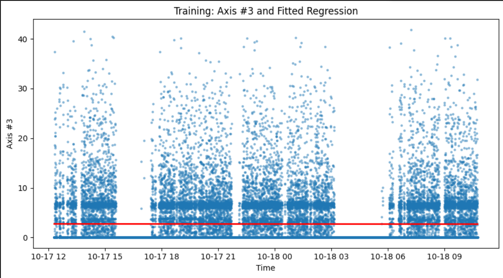
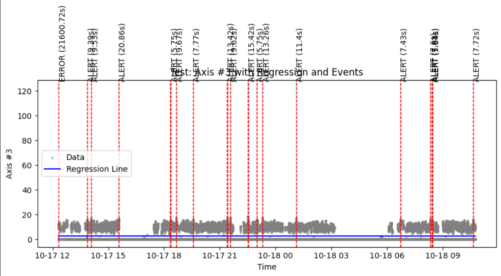
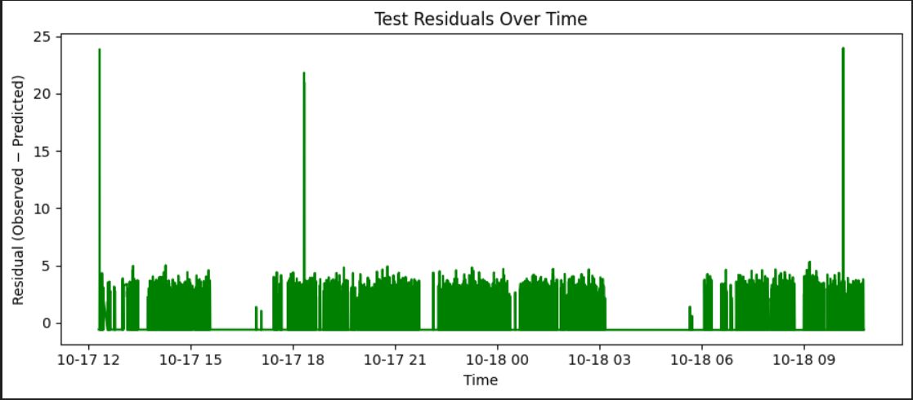
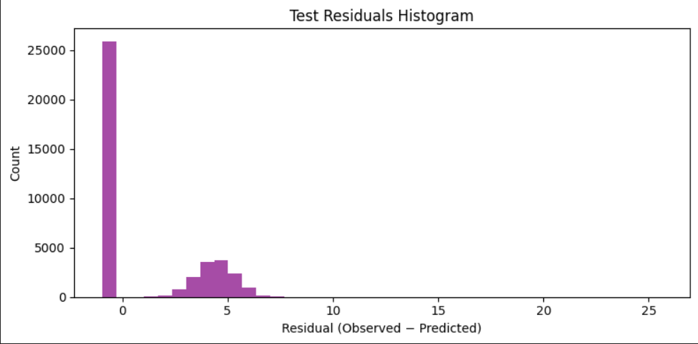

# Axis Anomaly Regression

## Project Summary
This project demonstrates predictive maintenance using linear regression and alert detection rules. 
The focus is on streaming sensor data (Axis values over Time) to establish a regression baseline, 
monitor deviations, and detect sustained anomalies.

The notebook performs these main steps:
1. Fit a linear regression baseline (Axis vs Time) using training data.
2. Record slope and intercept of the regression line.
3. Predict values on test data and calculate residuals (observed − predicted).
4. Focus on positive residuals as potential anomaly signals.
5. Derive thresholds for anomaly detection using quartile-based and standard deviation-based methods.
6. Estimate a persistence time (T) with a 2-second grace rule to identify sustained events.
7. Detect alerts and errors, log them with metadata (event_id, level, start_time, end_time, duration, residuals).
8. Plot regression fits, residual distributions, and anomaly event overlays.
9. Export detected events to CSV.

## Setup Instructions
1. Install Python 3.9 or later.
2. Clone this repository or download the notebook.
3. Install dependencies:
   ```bash
   pip install -r requirements.txt
   ```
4. Ensure you have access to the training database table (`rmbr4_2_export_train`) and test CSV file.
    * The `rmbr4_2_export_train` DB connection string is secret and saved in the `.env` file. 
    * The test CSV file is in the `data` folder in this repository.
    * NOTE: The DB contains the training dataset, while the `data/RMBR4-2_export_test.csv` contains the syntehic data generated by LLM.
5. Run the notebook step by step.

## Regression and Alert Rules
- **Regression**: A simple univariate linear regression is trained on Time (independent variable) and Axis values (dependent variable).
- **Residuals**: Residual = Observed − Predicted. Only positive residuals are considered for alerts.
- **Thresholds**:
  - *Quartile-based*: Use Q1 and Q3 of residuals to define MinC and MaxC.
  - *Std-based*: Use mean ± k×std of residuals.
- **Persistence Time (T)**: Minimum duration an anomaly must persist to qualify as an alert. Estimated from training residual sequences with a 2-second grace rule.
- **Alert Types**:
  - **Alert**: Residuals above MinC for at least T seconds.
  - **Error**: Residuals above MaxC for at least T seconds.

## Outputs
- Visual plots of regression lines, residual histograms, and detected anomalies.
- CSV file (in the `logs` folder) of events containing:
  - event_id
  - level (Alert/Error)
  - start_time
  - end_time
  - duration_sec
  - peak_residual
  - mean_residual
  - area_above_baseline

## Some Plots of Results





